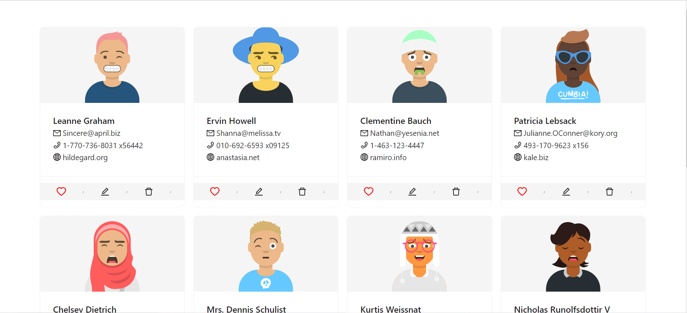

# User Profile - ExtraaEdge Assignment

A React-based User Management App that displays user profiles fetched from an API. The app allows users to mark profiles as favorites, edit user details via a modal form, and delete user profiles. The app includes a loading indicator, responsive design, and integrates **Ant Design** for styling.

---

## Features

- Displays a list of user profiles with their avatars, name, email, phone, website, and company name.
- Fetches user data from the [JSONPlaceholder API](https://jsonplaceholder.typicode.com/users).
- Dynamically generates unique avatars for each user using [DiceBear Avatars API](https://dicebear.com/).
- Implements `Favorite`, `Edit`, and `Delete` functionality for user profiles.
- Edit user details via a modal form with inputs and labels aligned side-by-side.
- Includes a loading spinner during data fetching.
- Fully responsive design for desktop, tablet, and mobile views.
- Uses Redux Toolkit for state management.
- Styled with Ant Design for buttons, cards, modals, and icons.

---

## Technologies Used

- **React**: Frontend library for building the user interface.
- **Redux Toolkit**: For efficient state management.
- **Ant Design**: For pre-styled UI components.
- **fetch**: For API requests.
- **Bootstrap**: Used for grid layout and spacing in some components.
- **JavaScript (ES6)**: Language used for development.

---

## Setup Instructions

### Prerequisites

Ensure you have the following installed:

- [Node.js](https://nodejs.org/) (v16 or later)
- [npm](https://www.npmjs.com/) or [yarn](https://yarnpkg.com/)

### Steps to Set Up the Project

1. **Clone the Repository**
   ```bash
   git clone https://github.com/Hisam-94/user-profile-assignment.git
   cd user-profile-assignment
   ```

2. **Install Dependencies**
   ```bash
   npm install
   ```
   or, if using yarn:
   ```bash
   yarn install
   ```

3. **Start the Development Server**
   ```bash
   npm start
   ```
   or, if using yarn:
   ```bash
   yarn start
   ```

   The app will be available at [http://localhost:3000](http://localhost:3000).

---

## API Endpoints

- **User Data**: `https://jsonplaceholder.typicode.com/users`
- **Avatar Images**: `https://api.dicebear.com/8.x/avataaars/svg?seed={username}`

---

## Folder Structure

```plaintext
user-management-app/
├── public/
│   ├── index.html          # Main HTML file
│   └── favicon.ico         # App favicon
├── src/
│   ├── components/
│   │   ├── Loader.jsx      # Spinner Component
│   │   ├── UserCard.jsx    # User Profile Card
│   │   └── UserList.jsx    # Component to list all users
│   ├── redux/
│   │   ├── store.js        # Redux Store Configuration
│   │   └── usersSlice.js   # Redux Slice for User State
│   ├── App.jsx             # Main App Component
│   ├── index.js            # App Entry Point
│   └── styles.css          # Custom Styles
├── package.json            # Project Metadata and Dependencies
└── README.md               # Project Documentation
```

---

## Features in Detail

### Favorite Button
- **UI**: A red outlined heart icon.
- **Behavior**: Clicking the heart icon toggles it to a filled red heart and adds/removes the user from the "favorites" list.

### Edit Modal
- **UI**: A modal form with inputs for `name`, `email`, `phone`, and `website`.
- **Behavior**: Labels and input boxes are aligned side-by-side.

### Delete Button
- **UI**: A trash bin icon.
- **Behavior**: Removes the user from the list and displays a success message.

### Loading Indicator
- Displays a spinner until the data is fetched from the API.

---

## Scripts

| Script         | Description                                |
|----------------|--------------------------------------------|
| `npm start`    | Starts the development server.             |
| `npm run build`| Builds the app for production.             |
| `npm test`     | Launches the test runner (if tests exist). |

---

## Screenshots

### User List Page



---


